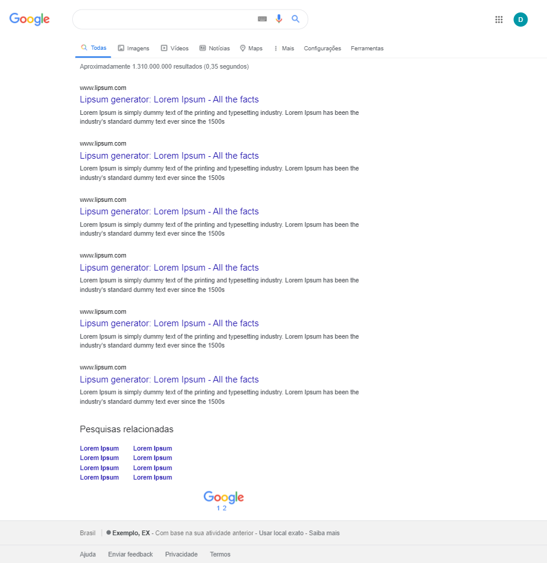

<h1 align="Center">Google search results</h1>

## Descrição

Essa é a minha solução para um exercício do curso de HTML e CSS da B7Web, O desafio era clonar a página de resultados do google. 

## Tecnologias usadas

<ul>
    <li>HTML</li>
    <li>CSS</li>
</ul>
<h2 align="center">
    <a href="https://grazziotti.github.io/Google-search-results/" style="border-bottom: 0px">Acessar a página</a>
</h2>

